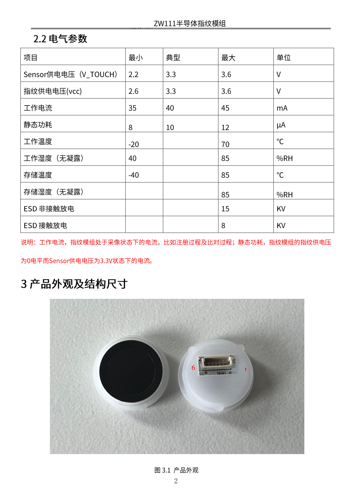
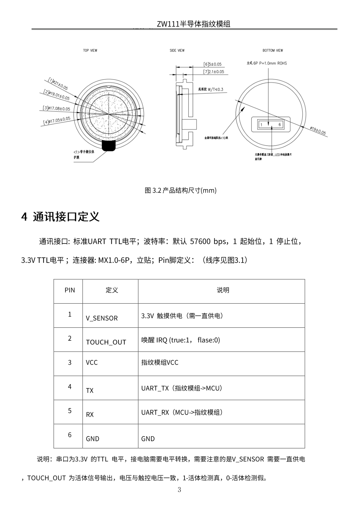
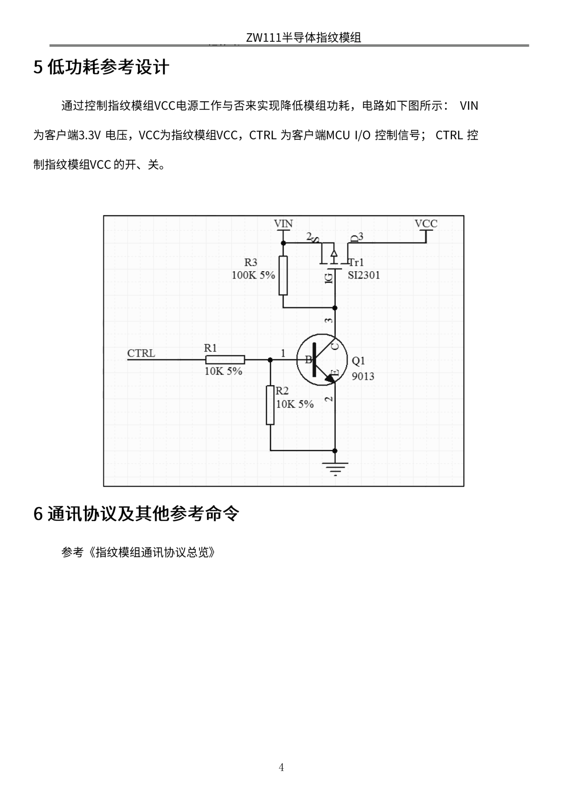

# ZW111 半导体指纹处理模块规格书 V1.2.2

> 本文档由 `doc/ZW111半导体指纹处理模块规格书V1.2.2.pdf` 转换而来。
> 原 PDF 正文以图片形式嵌入（6 页含 328 个图片对象，可提取文本仅 2652 字符），
> 因此内容由页面渲染图 `md/pages/ZW111-p0*.png` 转录，图片与电路图请对照原页查看。

## 目录

| 章节 | 标题 | 页码 |
|---|---|---|
| 1 | 产品概述 | 1 |
| 2 | 技术参数 | 1 |
| 2.1 | 性能参数 | 1 |
| 2.2 | 电气参数 | 2 |
| 3 | 产品外观及结构尺寸 | 2 |
| 4 | 通讯接口定义 | 3 |
| 5 | 低功耗参考设计 | 4 |
| 6 | 通讯协议及其他参考命令 | 4 |

---

## 1 产品概述

ZW111 是一款一体化半导体指纹处理模组，由主动式半导体指纹采集 SENSOR 和指纹识别处理芯片构成。

指纹识别算法芯片采用高性能、低功耗 RiscV 内核，运行 360 度自适应自学习算法。半导体 Sensor 采用主动式射频采集方式，支持低功耗手指检测，省去外挂手指触摸检测芯片，集成度高，产品结构简单，提高了产品稳定性和一致性。提供七彩灯效果，可根据用户需求定制不同颜色以及显示方式。

---

## 2 技术参数

### 2.1 性能参数

| 项目 | 参数 |
|---|---|
| 像素 | 88 × 112 |
| 分辨率 | 500 DPI |
| 芯片封装 | Ø15 mm × 0.6 mm |
| 模组封装 | Ø21 mm × 5.0 mm |
| 比对速度 | < 0.8 s |
| 启动时间 | < 0.1 s |
| 采像时间 | < 0.06 s |
| 拒真率（FRR） | < 3% |
| 误识率（FAR） | < 0.0001% |
| 存储容量 | **100 枚**（原文档此处高亮标注） |
| 按压次数 | 1,000,000 次 |

### 2.2 电气参数

| 项目 | 最小 | 典型 | 最大 | 单位 |
|---|---|---|---|---|
| Sensor 供电电压（V_TOUCH） | 2.2 | 3.3 | 3.6 | V |
| 指纹供电电压（VCC） | 2.6 | 3.3 | 3.6 | V |
| 工作电流 | 35 | 40 | 45 | mA |
| 静态功耗 | 8 | 10 | 12 | µA |
| 工作温度 | -20 | | 70 | °C |
| 工作湿度（无凝露） | 40 | | 85 | %RH |
| 存储温度 | -40 | | 85 | °C |
| 存储湿度（无凝露） | | | 85 | %RH |
| ESD 非接触放电 | | | 15 | KV |
| ESD 接触放电 | | | 8 | KV |

> **说明**：工作电流，指纹模组处于采像状态下的电流，比如注册过程及比对过程；静态功耗，指纹模组的指纹供电电压为 0 电平而 Sensor 供电电压为 3.3V 状态下的电流。

---

## 3 产品外观及结构尺寸

*图 3.1 产品外观* —— 左侧为正面（黑色圆形指纹采集面），右侧为背面，可见 6P 连接器，丝印标号 1 与 6。

*图 3.2 产品结构尺寸(mm)* —— 含 TOP VIEW / SIDE VIEW / BOTTOM VIEW 三视图。

关键尺寸：

| 标注 | 尺寸 |
|---|---|
| ① | Ø21 ± 0.05 |
| ② | Ø19.01 ± 0.05 |
| ③ | Ø17.08 ± 0.05 |
| ④ | Ø17.05 ± 0.05 |
| ⑤ | 底膜 W/T < 0.3 |
| ⑥ | 5 ± 0.05 |
| ⑦ | 2.1 ± 0.05 |

其他标注：

- 立式 6P，P = 1.0 mm，ROHS
- Ø19 ± 0.05
- 金属环接地阻抗 < 10 欧
- 元器件位置呈三防胶，LED 和连接器只点引脚
- <1> 带手指位保护膜

---

## 4 通讯接口定义

**通讯接口**：标准 UART TTL 电平；**波特率：默认 57600 bps**，1 起始位，1 停止位，3.3V TTL 电平；连接器：MX1.0-6P，立贴；Pin 脚定义见下表（线序见图 3.1）。

| PIN | 定义 | 说明 |
|---|---|---|
| 1 | V_SENSOR | 3.3V 触摸供电（需一直供电） |
| 2 | TOUCH_OUT | 唤醒 IRQ（true:1, false:0） |
| 3 | VCC | 指纹模组 VCC |
| 4 | TX | UART_TX（指纹模组 → MCU） |
| 5 | RX | UART_RX（MCU → 指纹模组） |
| 6 | GND | GND |

> **说明**：串口为 3.3V 的 TTL 电平，接电脑需要电平转换。需要注意的是 V_SENSOR 需要一直供电，TOUCH_OUT 为活体信号输出，电压与触控电压一致，1 = 活体检测真，0 = 活体检测假。

### 对接到本项目的接线要点

- MCU 的 **TX 应接模组的 PIN 5 (RX)**，MCU 的 **RX 应接模组的 PIN 4 (TX)**。
- 本项目代码中 `uart_set_pin(UART_NUM_1, GPIO17, GPIO18, ...)` 即 MCU 侧 TX = GPIO17、RX = GPIO18。
- `V_SENSOR`（PIN 1）必须**常供电**，触摸唤醒功能依赖它；否则低功耗唤醒不可用。
- `TOUCH_OUT`（PIN 2）可作为手指按下中断源使用，本项目暂未使用。

---

## 5 低功耗参考设计

通过控制指纹模组 VCC 电源工作与否实现降低模组功耗，电路如下图所示：VIN 为客户端 3.3V 电压，VCC 为指纹模组 VCC，CTRL 为客户端 MCU I/O 控制信号；CTRL 控制指纹模组 VCC 的开、关。

电路元件：

| 位号 | 型号/参数 | 说明 |
|---|---|---|
| Q1 | 9013 | NPN 三极管，基极经 R1 接 CTRL，发射极接地 |
| Tr1 | SI2301 | P 沟道 MOSFET，源极接 VIN，漏极接 VCC，栅极经 R3 上拉到 VIN、经 Q1 集电极下拉 |
| R1 | 10K 5% | 基极限流 |
| R2 | 10K 5% | 基极下拉 |
| R3 | 100K 5% | 栅极上拉 |

> 注：该设计通过切断 VCC 实现掉电式休眠。本项目当前采用软件休眠指令（`PS_Sleep`，指令码 `0x33`）实现低功耗，与此硬件方案是两条并行路径。

---

## 6 通讯协议及其他参考命令

参考《指纹模组通讯协议总览》。

---

## 附：与项目代码相关的关键结论

1. **默认波特率 57600 bps**，1 起始位 / 1 停止位 / 无校验 / 8 数据位。
   —— 项目代码 `components/AS608_ESP-IDF/fingerID.cpp` 的 `init_uart2id()` 原先误写为 `75600`，已修正。
2. 休眠指令码为 `0x33`（本项目 `IDENTIFIER::PS_Sleep()` 已使用该值）。
3. 模组供电需 3.3V，工作电流典型 40 mA、峰值 45 mA，**USB 直接供电时需注意压降**。
4. `V_SENSOR`(PIN 1) 需常供电；`TOUCH_OUT`(PIN 2) 为活体/触摸中断输出，高电平有效。
